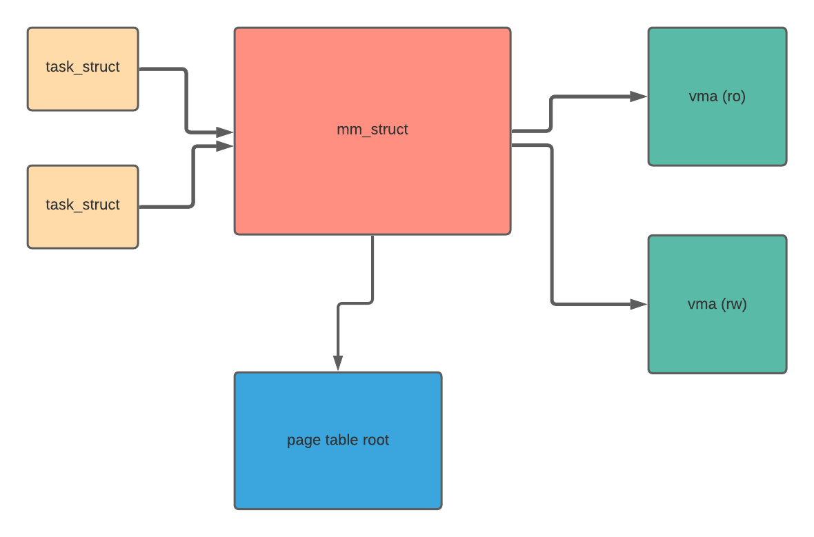
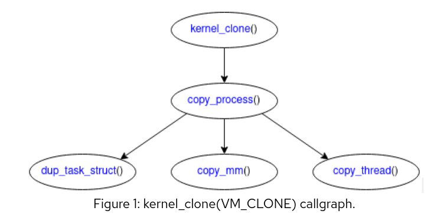
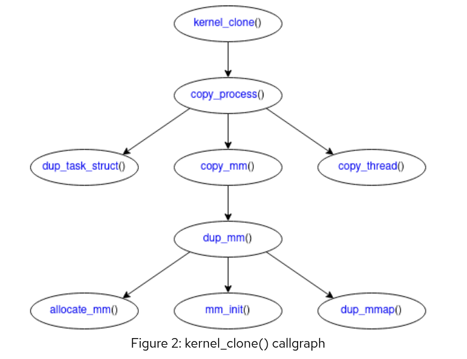
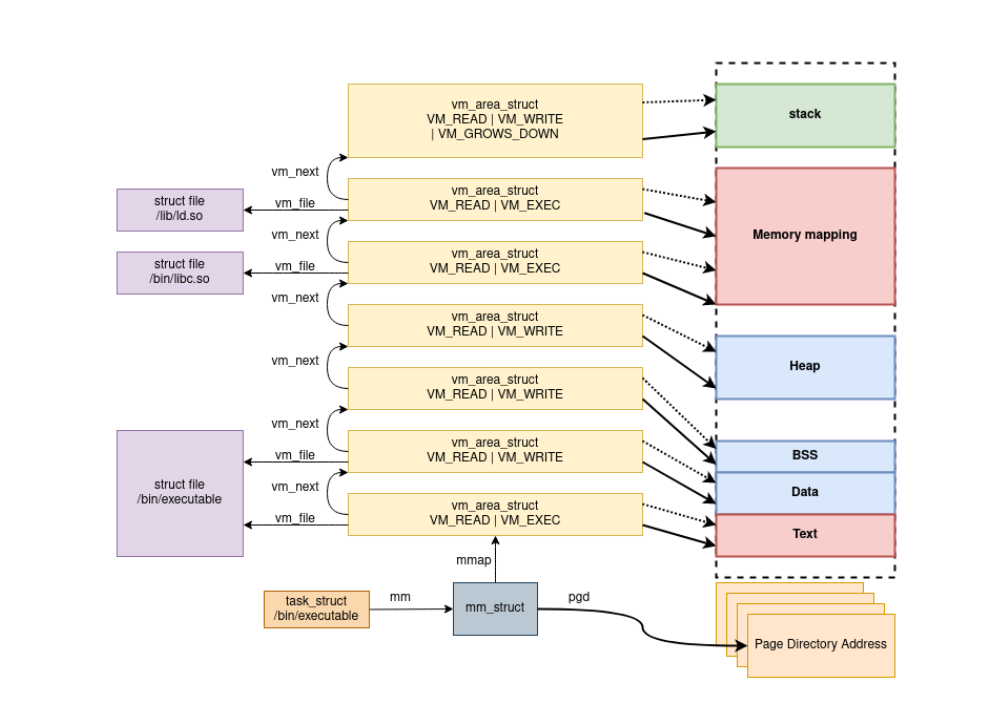

<!-- Output copied to clipboard! -->


# Address Space Protection for FuSa


## Kernel and architecture protection

Christoffer Hall-Frederiksen

Gabriele Paoloni

Alessandro Carminati

Eric Chanudet

With help from the Red Hat MM team.


# 


# Contents


[TOC]


# Abbreviations


<table>
   <td>FuSa
   </td>
   <td>Functional Safety
   </td>
  </tr>
  <tr>
   <td>MMU
   </td>
   <td>Memory Management Unit
   </td>
  </tr>
  <tr>
   <td>TLB
   </td>
   <td>Translation Lookaside Buffer
   </td>
  </tr>
  <tr>
   <td>VMA
   </td>
   <td>Virtual Memory Area
   </td>
  </tr>
</table>


# 


# Introduction

This document derives from the [investigation](https://docs.google.com/document/d/1JrjBHuYopU9Z7xOwm7KOc5DTKzRnvjk-NIY2QfBlBs0/edit?userstoinvite=qclzdh%40gmail.com&actionButton=1) that started in the ELISA Safety Architecture WG. The high level safety goal is  \
&lt;<To maintain and enforce the integrity of the process address space along with the process lifecycle or detect an integrity violation failure (system level measures or additional mechanisms in the Kernel)>>


# Safety Goals

**SG01:** The Kernel shall properly create the address space of the safety critical application when the associated process is spawned.

**SG02: **The Kernel shall  maintain the integrity of the safety application process descriptor, process address spaces and associated structures at runtime when memory is allocated, used and freed.

**SG03: **The Kernel shall maintain the integrity of process descriptors and process address spaces at runtime when doing context switches

**SG04:  **At boot time the Kernel shall properly configure the subsystems and the HW supporting the integrity of safety application address space upon its creation and at also at runtime (i.e. the role of start_kernel)

**SG05:** At boot time the Kernel shall properly create its own address space and configure the subsystems and the HW supporting its integrity and protection

**SG06: **At runtime the Kernel shall maintain its own address space integrity and protection  upon memory allocation, release and context switching from user space into kernel space


# Safety Goal Argumentation

# Architecture and Hardware Protections

## Processor permission levels

Modern processors have different privilege levels. Sometimes they are called exception levels or rings and define which operations are possible. The kernel will execute at a higher privilege level than processes since it handles hardware and the kernel is the permission arbiter of a system. The ability to access memory and to configure virtual memory is dependent on the privilege level. A user-space process will not be able to manipulate physical memory or configure how it’s virtual memory is configured -the hardware setup requires a higher privilege level and therefore it's up to the operating system kernel or hypervisor. 


## MMU

The MMU is a piece of hardware that translates virtual memory addresses to physical memory addresses through one or more stages. Mapping virtual to physical memory addresses can happen during a trap to the operating system (also known as “page fault”) that will set up page tables to map the faulting virtual address to the respective physical memory. 

Another function of the MMU is memory protection.The MMU by looking up the page tables decides if any virtual address accessed by the CPU while the program runs is valid or invalid. If valid the MMU obtains, from the page table walk, the physical address of the memory. The privileged operating system kernel or hypervisor controls the behavior of the MMU precisely by manipulating the page tables. This protection is the most important component when it comes to address-space integrity for FuSa. Any per-page protection in a modern processor usually comes from some form of MMU. Some processors have specific MMUs for I/O which will be dealt with separately later in the document.


## TLB 

The Translation Lookaside Buffer is a cache looked up by the MMU when it has to translate any virtual address. Only if the TLB has no cached entry for the given virtual address that can satisfy the given virtual memory access, the MMU then proceeds with the page table walk. If the page table walk is successful the MMU stores the result in a cached TLB entry in the hope of not having to repeat the page table walk if the same virtual address range is accessed again later by the CPU.

Because of the TLB caching effect, if a mapping is removed from the page tables the operative system kernel or hypervisor has to also invalidate the TLB with an operation called “TLB flush” before the MMU stops resolving the removed mapping. Depending on hardware implementations the TLB can provide more or less selective ways to execute the TLB flush operation. On some hardware implementations it's possible for the operative system software to tag the TLB entries before they’re established. So for example all TLB entries of a given process could be set up to share the same tag (also known as ASN as in Address Space Number or PCID as in Process ID) to later be able to limit the flush to a single tag and in turn potentially to a single process.


## Interrupts

Both hardware and software interrupts have commonalities. They both preserve the process state (registers, etc.) and then can end up in  another process being scheduled. Scheduling a new process involves switching to a new virtual memory. Since context switches that originate from an interrupt are handled exactly like non-interrupt driven context switches - it all ends up in the same code and it will be covered later. It should be noted that all interrupts are handled in privileged mode and in kernel space. 


# Kernel Protections


## Identifying a process

The Linux kernel identifies a process as a number of tasks (threads) sharing an address space. The traditional definition of a process is one or more threads of execution executing within the same address space. In Linux each task has an mm_struct that describes an address space. An mm_struct can be shared between threads in case of multithreaded programs. 

Each thread  has additional states that need to be kept. When a trap to the kernel happens, be it hardware or software generated, each thread (task_struct)  keeps a thread_info that saves the relevant information to restart the processes after  each handled interrupt (task_struct -> thread_info -> cpu_context) on a given CPU. 


### Kernel side structures of a process


* struct task_struct 
    * mm_struct mm
    * mm_struct active_mm
    * struct restart_block
    * struct thread_struct
    * void *stack 





A more detailed diagram can be found later in in the document.


### Process Memory Management 

The above describe data structures that form the concept of a process inside Linux. Given how the MMU is set up and handled by the kernel it is not possible for a process to directly access another process's address space except via explicit kernel constructs through either syscalls or some form of filesystem access. A direct access of a user space pointer into a VA that is not mapped in the process address space results in an MMU exception.

Under the assumption that these kernel constructs are either disabled or that processes are not started with privileges to access these special kernel constructs, which is a matter of process user and group permissions, then any attempt to access another process memory is not possible by virtue of simply not being physically addressable. Any and all translations of virtual to physical will happen entirely inside each process's  address space. A more code-centric argument is that the page table walker cannot go beyond the mm_struct of a process , and therefore cannot access another process's address space, unless special kernel constructs are employed. 

A process’s virtual address space is divided into vm areas and each is covered by a vm_area_struct. A vm_area_struct represents a section of memory with a specific configuration in the MMU. Typically text/code segments are read-only and will be marked as such in the MMU - any attempt to write to this area will result in an exception from the MMU. Other sections can be marked as read-write. Each vm-area has a set of operations attached to it (function pointers), for instance some areas will be backed by a file (executable code, memory mapped files etc.) that enables paging in and out of memory. Not all areas are backed by files and will have a different set of operations attached to them. 


## Starting and stopping processes

Traditionally Unix-type systems have used forking as a mechanism to start new processes. A copy of the process is created and the address space is set up in a copy-on-write mode, meaning the address spaces will diverge on updates of memory. Linux has modified this concept into what is called clone. Clone can start both a new process and it can start new threads. Or to put it in other terms, clone starts a new thread and if you pass the right flags to clone it will also create a new address space and therefore a new process.

Linux has several syscalls to start new processes and threads, but at the kernel level they all end up in the function called kernel_clone. The argument to kernel_clone that separates thread creation from process creation is the flag CLONE_VM. Basically it says we need a copy-on-write copy or clone of the virtual memory. When it comes to address-space integrity of a Linux process then we need to focus on kernel_clone. Every call to kernel_clone that has the  CLONE_VM flag set will result in calling the copy_mm function via the copy_process function. copy_mm  will set up new page tables.  


### Kernel thread




Figure 1: kernel_clone(VM_CLONE) callgraph.

Kernel threads descend from [kthreadd](https://github.com/torvalds/linux/blob/8bb7eca972ad531c9b149c0a51ab43a417385813/kernel/kthread.c#L657), created before init (PID 1) is started. This is a special context initialized early on and used to spawn a process before init has had a chance to start. To create a kernel thread, [kernel_clone](https://github.com/torvalds/linux/blob/8bb7eca972ad531c9b149c0a51ab43a417385813/kernel/fork.c#L2543)() is called, from the kernel context, via [kernel_thread](https://github.com/torvalds/linux/blob/8bb7eca972ad531c9b149c0a51ab43a417385813/kernel/fork.c#L2626)(). Specific flags are passed to the routine, notably [CLONE_VM](https://github.com/torvalds/linux/blob/8bb7eca972ad531c9b149c0a51ab43a417385813/include/uapi/linux/sched.h#L11) for the scope of this document, instructing the process creation to share the address space between parent and child.

All kernel threads share the same memory address space, but each uses a different stack in it. When a [struct task_struct](https://github.com/torvalds/linux/blob/8bb7eca972ad531c9b149c0a51ab43a417385813/include/linux/sched.h#L723) is duplicated during [kernel_clone](https://github.com/torvalds/linux/blob/8bb7eca972ad531c9b149c0a51ab43a417385813/kernel/fork.c#L2543)(), a new thread stack is allocated for this process’ kernel context execution (see figure 1, [dup_task_struct](https://github.com/torvalds/linux/blob/8bb7eca972ad531c9b149c0a51ab43a417385813/kernel/fork.c#L874)()). Depending on the kernel configuration, the stack is initialized with the relevant integrity mechanisms available (see [Stack and Heap Protection](https://docs.google.com/document/d/1gzGz4Ziq3Oa3T_AAvEqbHoA31NCW2AcOPGOfFgfWBPo/edit#heading=h.rs76zaqeweni)).

 \
[A new mm_struct is not created](https://github.com/torvalds/linux/blob/8bb7eca972ad531c9b149c0a51ab43a417385813/kernel/fork.c#L1494) when a kernel thread is spawned. Kernel threads are particular in that they are [Anonymous Processes](https://docs.google.com/document/d/1gzGz4Ziq3Oa3T_AAvEqbHoA31NCW2AcOPGOfFgfWBPo/edit#heading=h.ybtzvjr1mpal). They generally do not use the user space address ranges allowing one to borrow an existing [mm_struct](https://github.com/torvalds/linux/blob/8bb7eca972ad531c9b149c0a51ab43a417385813/include/linux/mm_types.h#L402) from a “real” process. There are exceptions where a kernel thread needs to manipulate a user space mapping, in which case it can request to borrow a specific [mm_struct](https://github.com/torvalds/linux/blob/8bb7eca972ad531c9b149c0a51ab43a417385813/include/linux/mm_types.h#L402) with [ktread_use_mm](https://github.com/torvalds/linux/blob/8bb7eca972ad531c9b149c0a51ab43a417385813/kernel/kthread.c#L1345)(). When scheduled, kernel threads will use the [active_mm](https://github.com/torvalds/linux/blob/8bb7eca972ad531c9b149c0a51ab43a417385813/include/linux/sched.h#L858), pointing to the borrowed [mm_struct](https://github.com/torvalds/linux/blob/8bb7eca972ad531c9b149c0a51ab43a417385813/include/linux/mm_types.h#L402). This optimization avoids costly context switches involving expensive TLB flushes (referred to as Lazy TLB Flush).


### User thread

Usually called threads from userland perspective. In a POSIX environment, this could be the result of calling [pthread_create](https://man7.org/linux/man-pages/man3/pthread_create.3.html)(), which in turn would use the [clone(2)](https://man7.org/linux/man-pages/man2/clone.2.html) syscall. Following, [kernel_clone](https://github.com/torvalds/linux/blob/8bb7eca972ad531c9b149c0a51ab43a417385813/kernel/fork.c#L2543)() is entered with the [CLONE_VM](https://github.com/torvalds/linux/blob/8bb7eca972ad531c9b149c0a51ab43a417385813/include/uapi/linux/sched.h#L11) flag, instructing the routine to share the address space of the parent process with the child. Just as with a kernel thread, [struct task_struct](https://github.com/torvalds/linux/blob/8bb7eca972ad531c9b149c0a51ab43a417385813/include/linux/sched.h#L723) is duplicated and a thread stack is allocated (see figure 1, [dup_task_struct](https://github.com/torvalds/linux/blob/8bb7eca972ad531c9b149c0a51ab43a417385813/kernel/fork.c#L2026)()). With the [CLONE_VM](https://github.com/torvalds/linux/blob/8bb7eca972ad531c9b149c0a51ab43a417385813/include/uapi/linux/sched.h#L11) flag, [copy_mm](https://github.com/torvalds/linux/blob/8bb7eca972ad531c9b149c0a51ab43a417385813/kernel/fork.c#L1475)() will not call [dup_mm](https://github.com/torvalds/linux/blob/8bb7eca972ad531c9b149c0a51ab43a417385813/kernel/fork.c#L1501)() and a new [mm_struct](https://github.com/torvalds/linux/blob/v5.15/include/linux/mm_types.h#L402) is not created. Instead [a reference is taken](https://github.com/torvalds/linux/blob/8bb7eca972ad531c9b149c0a51ab43a417385813/kernel/fork.c#L1501) on the parent [mm_struct](https://github.com/torvalds/linux/blob/v5.15/include/linux/mm_types.h#L402), so both parent and child are able to access the same memory mappings described in [mm_struct](https://github.com/torvalds/linux/blob/v5.15/include/linux/mm_types.h#L402).

The user memory address space handling is mostly left to the [execve(2)](https://man7.org/linux/man-pages/man2/execve.2.html) family of syscalls. [kernel_clone](https://github.com/torvalds/linux/blob/8bb7eca972ad531c9b149c0a51ab43a417385813/kernel/fork.c#L2543)() takes a new stack pointer [as argument](https://github.com/torvalds/linux/blob/8bb7eca972ad531c9b149c0a51ab43a417385813/include/linux/sched/task.h#L21). Since the address space is shared between parent and child, the caller of [clone(2)](https://man7.org/linux/man-pages/man2/clone.2.html) in user space has to initialize the new stack. The kernel does not interfere with integrity mechanisms that the loaded program may have put in place. The stack is set in the architecture specific implementation of [copy_thread](https://github.com/torvalds/linux/blob/8bb7eca972ad531c9b149c0a51ab43a417385813/arch/arm64/kernel/process.c#L318)(). When the thread is scheduled, execution in the child will resume following where the parent called [kernel_clone](https://github.com/torvalds/linux/blob/8bb7eca972ad531c9b149c0a51ab43a417385813/kernel/fork.c#L2543)(), but using the new stack pointer.


### User process





Figure 2: kernel_clone() callgraph

Usually created by userland calling the [fork(2)](https://man7.org/linux/man-pages/man2/fork.2.html) family of syscalls, although [clone(2)](https://man7.org/linux/man-pages/man2/clone.2.html) is used in some circumstances. Apart from init (PID = 1), which has its context initialized entirely by the kernel, all user processes are created by the duplication method provided by [fork(2)](https://man7.org/linux/man-pages/man2/fork.2.html).

[kernel_clone](https://github.com/torvalds/linux/blob/8bb7eca972ad531c9b149c0a51ab43a417385813/kernel/fork.c#L2543)() is not passed [CLONE_VM](https://elixir.bootlin.com/linux/latest/source/include/uapi/linux/sched.h#L11) and [copy_mm](https://elixir.bootlin.com/linux/latest/source/kernel/fork.c#L1475)() will call [dup_mm](https://github.com/torvalds/linux/blob/8bb7eca972ad531c9b149c0a51ab43a417385813/kernel/fork.c#L1501)() to create a new [mm_struct](https://github.com/torvalds/linux/blob/v5.15/include/linux/mm_types.h#L402). In this path, each memory mapping has to be examined to determine how the new [mm_struct](https://github.com/torvalds/linux/blob/v5.15/include/linux/mm_types.h#L402) should handle it. [dup_mmap](https://github.com/torvalds/linux/blob/8bb7eca972ad531c9b149c0a51ab43a417385813/kernel/fork.c#L489)() is where this logic happens.

Each Virtual Memory Area (VMA) is represented in [mm_struct](https://github.com/torvalds/linux/blob/v5.15/include/linux/mm_types.h#L402) by a [struct vm_area_struct](https://elixir.bootlin.com/linux/latest/source/include/linux/mm_types.h#L319). For the scope of this document, two flags have to be considered for each VMA: [VM_DONTCOPY](https://elixir.bootlin.com/linux/latest/source/kernel/fork.c#L532) and [VM_WIPEONFORK](https://elixir.bootlin.com/linux/latest/source/kernel/fork.c#L562). Each will affect how the address space of the created process changes from its parent.

[VM_DONTCOPY](https://elixir.bootlin.com/linux/latest/source/kernel/fork.c#L532) flags a VMA to not be part of the duplicated memory mappings. This is sometimes used for userspace buffers configured to be used for DMA by some hardware, but where [VM_SHARED](https://elixir.bootlin.com/linux/latest/source/include/linux/mm.h#L273) is not applicable and prevents a copy-on-write that would change the physical page backing the one accessed by the memory mapping.

[VM_WIPEONFORK](https://elixir.bootlin.com/linux/v5.15.17/source/kernel/fork.c#L562) only applies to [Anonymous Mappings](https://docs.google.com/document/d/1gzGz4Ziq3Oa3T_AAvEqbHoA31NCW2AcOPGOfFgfWBPo/edit#heading=h.19fttpu8dwkk). The flagged VMA is added to the new [mm_struct](https://github.com/torvalds/linux/blob/v5.15/include/linux/mm_types.h#L402), but the page-table entries describing the mapping of the parent process will not be copied into the VMA of the child. Consequently, the child accessing an address in the flagged VMA will trigger a fault and a new mapping to a zeroed page will be created by the page fault handler.

This flag allows a process to prevent sensitive memory regions to be shared in its child, for example areas containing pseudo-random number generator seeds or private cryptographic secrets.

Finally, with neither [VM_DONTCOPY](https://elixir.bootlin.com/linux/latest/source/kernel/fork.c#L532) or [VM_WIPEONFORK](https://elixir.bootlin.com/linux/latest/source/kernel/fork.c#L562), [dup_mmap](https://github.com/torvalds/linux/blob/8bb7eca972ad531c9b149c0a51ab43a417385813/kernel/fork.c#L489)() duplicates the VMA, and adds it to the new [mm_struct](https://github.com/torvalds/linux/blob/v5.15/include/linux/mm_types.h#L402). Page-Table Entries (PTE) [can be populated](https://github.com/torvalds/linux/blob/8bb7eca972ad531c9b149c0a51ab43a417385813/kernel/fork.c#L610) at this stage. To make [fork(2)](https://man7.org/linux/man-pages/man2/fork.2.html) faster, as much as possible is deferred to the page-fault handler when it is possible to find the mapping to the original page later (e.g, regular mappings to pages backed by a file). [Anonymous mappings](https://docs.google.com/document/d/1gzGz4Ziq3Oa3T_AAvEqbHoA31NCW2AcOPGOfFgfWBPo/edit#heading=h.19fttpu8dwkk) (e.g, heap, stack) PTEs are populated during [dup_mmap](https://github.com/torvalds/linux/blob/8bb7eca972ad531c9b149c0a51ab43a417385813/kernel/fork.c#L489)(), as well as  huge-page entries and any VMA that with mappings not backed by a [struct page](https://github.com/torvalds/linux/blob/8bb7eca972ad531c9b149c0a51ab43a417385813/include/linux/mm_types.h#L70).


### Capabilities

The root user has all privileges in the Linux kernel, but those privileges can be broken down, restricted and sometimes passed on to even non-root processes. A classic example of this would be the right to bind a network daemon to a port below 1024 like a web server without needing all other permissions of root. Capabilities are smart because they introduce granular control of “what root can do”. This does, however, have an impact on FuSa for better and for worse.  Giving the wrong, or too many, capabilities to a process increases the potential downfall in case of error. Special attention needs to be on capabilities when starting a process. 


## User and group permissions

The Linux kernel has many entry points available through special file-systems and through special files in traditional file-systems[^1]. This puts requirements on user-processes and specifically what user and group permissions they run with. The constructs in the filesystem that could potentially interfere with a process memory are all owned by root and it is therefore critical  what the user and group id of a process is and specifically that it cannot be root (uid 0 and/or gid 0).


### **Stack and Heap Protections**

In user-space there are three basic allocation methods: stack, heap and memory mapped.  The allocations are not as simple as in user-space, but some of the same principles apply. Let’s start with user-thread stacks when there has been a trap into kernel mode. 

Each thread in Linux has a stack page allocated in the kernel and that stack is unaddressable from user-space. When a running user-space thread is either preempted or makes a call to the kernel, one of the first steps is to switch stack-pointer to this page. 

Protection mechanisms around these stack pages can be:


* a faulting memory hole that prevents kernel stack overflow (CONFIG_VMAP_STACK)
* a faulting memory hole that prevents kernel stack underflow (CONFIG_VMAP_STACK)
* a stack canary placed between the return address and the stack variables in order to detect stack buffer overflow (CONFIG_CC_STACKPROTECTOR)

The above configuration options for the Linux kernel implements protection for overflow/underflow of both stack depth and stack buffers. The first two are hardware protections and the third is a software measure being taken. 

When it comes to heap-like allocations there are a number of options. The areas of virtual memory used are described later in Kernel Address Space Layout, but memory for heap-like allocations come from the kernel logical map (kmalloc), vmemmap and vmalloc.  
The only hardware protection available in these allocations are in vmalloc where the default behaviour is to allocate faulting memory holes (guard pages) unless vmalloc is passed the VM_NO_GUARD flag (dangerous and discouraged).


### Process Kernel Mode Address Space Layout


Kernel threads see the entire kernel memory as described later in [Kernel Address Space Layout](#heading=h.8b4uzna03ifp). They do, however, operate under slightly alternate address space setup. When a kernel thread runs it will "borrow" a user-space process ASN (or ASID on arm64). It does this to avoid flushing either the entire or parts of the TLB. It will not put invalid data in the TLB, but it will push out a some TLB entries for a given user-space process (typically the last one to execute on that processor). It is an optimization, but a safe one. 


### User Mode Address Space Layout

A user-space process is protected by construction of the page-tables. Unlike when a process is in kernel-mode, a process in user-mode will be severely restricted in what can be addressed due to the setup of its page-tables. The actual layout of user-space memory can be found on the right hand side of the figure below and the kernel structures that relate to them are on the left. 

User-space layout and kernel structures:





The main structure that represents an address space in the kernel is mm_struct. Each mm_struct is linked to the page tables and links to a number of vm_area_struct and each such vma (virtual memory area). A process would have the following main areas:


* **Code area(s)**: One or more read-only vm_area_struct are set up for these memory areas of user-space. Any attempt to write to this area will result in a memory fault from the hardware. A single process can have multiple such code areas due to for instance dynamically linked libraries etc. 
* **Stack area(s)**: Each thread will have a read/write stack area allocated to it and each stack area has both guard pages surrounding it and a stack canary value. The guard pages protect against over/underflow and the canary enables error detection. 
* **Heap areas(s)**: Each thread will have a read-write heap area allocated to it and each stack area has guard pages surrounding it.
* **Memory mapped area(s)**: Memory mapped areas are a bit of a mixed bag. They can be both read-only or read-write. A memory mapped file will tend to be read-write whereas a dynamically linked library will typically have read-only containing code like the code areas above. 


### Booting Up The Kernel

When the kernel boots up a lot of low level initialization takes place. At boot the kernel operates on physical memory. On aarch64 it is in the [very early stages of boot](https://github.com/torvalds/linux/blob/3bf7edc84a9eb4007dd9a0cb8878a7e1d5ec6a3b/arch/arm64/kernel/head.S#L47) that two initial tasks are done before jumping to the generic [start_kernel()](https://github.com/torvalds/linux/blob/3bf7edc84a9eb4007dd9a0cb8878a7e1d5ec6a3b/init/main.c#L927) and that is to [prepare cpu for enabling the mmu](https://github.com/torvalds/linux/blob/3bf7edc84a9eb4007dd9a0cb8878a7e1d5ec6a3b/arch/arm64/mm/proc.S#L402) and then doing [ init mmu](https://github.com/torvalds/linux/blob/3bf7edc84a9eb4007dd9a0cb8878a7e1d5ec6a3b/arch/arm64/kernel/head.S#L701). This means that right from the start the 1-to-1 mapping of virtual memory for the kernel is done and then it will [jump to start_kernel()](https://github.com/torvalds/linux/blob/3bf7edc84a9eb4007dd9a0cb8878a7e1d5ec6a3b/arch/arm64/kernel/head.S#L468). This happens as some of the first instructions executed in the kernel. 

Once inside [start_kernel()](https://github.com/torvalds/linux/blob/3bf7edc84a9eb4007dd9a0cb8878a7e1d5ec6a3b/init/main.c#L927) it will become time to initialize the needed hardware. The initialization can happen in one of two ways in the kernel. Either the device tree is walked and init functions are called or the acpi tables are walked and init functions are called from there. 

### Spawning A New Process Or Thread

All the Linux methods for starting a new process all end up in kernel_clone through different paths. This is true for anything from fork and vfork to explicit calls to clone (ie. from pthread_create etc.. Or to put it in other words, all roads truly do lead to kernel_clone and as such this is the only entry point for starting new processes in Linux. This is what needs to be examined.   

In the code, kernel_clone will call the function copy_process unless error conditions are reached. copy_process will reach eventually reach copy_mm given no error conditions and then this is the key piece of code in kernel/fork.c:


```
if (clone_flags & CLONE_VM) {
        mmget(oldmm);
        mm = oldmm;
} else {
        mm = dup_mm(tsk, current->mm);
        if (!mm)
                return -ENOMEM;
}
```


What the above code does is either increase the reference count on the data structures representing the address space (mmget(oldmm)) or it will create new tables as a duplicate of the existing tables and therefore it will create a new address space for a process. Note that all pages are copy-on-write and the actual pages are not duplicated until a change is made to a given page. 

The above ensures the existence of a physically protected new address space. If the new process will continue as a clone/fork of the previous or a new process is started with members of the exec family of syscalls (fork/exec model) is per se irrelevant for the integrity of the address spaces because they will be guarded by separate page tables and copy-on-write semantics. 


### Context Switches 

Modern processors will keep the memory address of the page table root in a register. Sometimes that register will keep a combined value, for instance on aarch64, as well as others, the register will also hold an address space id (ASID)[^2]. 

When a context switch has to be made on a processor core, the Linux kernel will perform two major steps before starting the new thread. 1) (re-)establish register state incl. stack pointer etc. and 2) (re-)establish virtual memory for the thread. The steps are in the function context_switch in kernel/core/sched.c. 

Switching registers state and virtual memory is usually quite architecture dependent, but it can be divided into a couple of logical steps. In case an actual context switch is needed and that context switch has a different virtual address space[^3] the following steps happen on all architectures:


* **Memory barrier:** Make sure the previous task has its state flushed to memory.
* **Flush TLB if needed:** Some architectures have some form of address-space identifiers and some do not. If an architecture has no address-space identifiers the TLB must be flushed. If an architecture has identifiers, only part of the TLB needs to be invalidated[^4]. 


* **Set up pointer to page-table root:** The MMU needs to be able to find the page-tables for a process and this pointer needs to be set up. Usually a pointer to the root of the page tables is stored in a register, but since it is a special register it is not part of the “conventional” (re-)establishing of register state. 

Reading through the context_switch function will assure you that this takes place when you follow the call stack from this function. 


### Description Of The Individual Configuration Options 


## [CONFIG_VMAP_STACK](https://github.com/torvalds/linux/blob/3bf7edc84a9eb4007dd9a0cb8878a7e1d5ec6a3b/arch/Kconfig#L1115)

Arguably the most ubiquitous kernel integrity measure is to allocate thread stacks in the vmalloc() area. Guard-pages are placed before and after the virtual range reserved to trigger faults on out-of-range accesses. The usual behavior is then to kill the offending task and report the behavior in system logs. For example, on Arm64, an overflow check is performed by [kernel_ventry](https://github.com/torvalds/linux/blob/3bf7edc84a9eb4007dd9a0cb8878a7e1d5ec6a3b/arch/arm64/kernel/entry.S#L57) and will kill a faulty task and report a [PANIC error](https://github.com/torvalds/linux/blob/3bf7edc84a9eb4007dd9a0cb8878a7e1d5ec6a3b/arch/arm64/kernel/traps.c#L866).


## [CONFIG_THREAD_INFO_IN_TASK](https://github.com/torvalds/linux/blob/3bf7edc84a9eb4007dd9a0cb8878a7e1d5ec6a3b/init/Kconfig#L98)

Processes depend on [struct task_struct](https://github.com/torvalds/linux/blob/3bf7edc84a9eb4007dd9a0cb8878a7e1d5ec6a3b/include/linux/sched.h#L728) for scheduling. On x86, [struct thread_info](https://github.com/torvalds/linux/blob/3bf7edc84a9eb4007dd9a0cb8878a7e1d5ec6a3b/arch/arm64/include/asm/thread_info.h#L24) was written at the bottom of the thread stack and used to find the current [struct task_struct](https://github.com/torvalds/linux/blob/3bf7edc84a9eb4007dd9a0cb8878a7e1d5ec6a3b/include/linux/sched.h#L728). [struct thread_info](https://github.com/torvalds/linux/blob/3bf7edc84a9eb4007dd9a0cb8878a7e1d5ec6a3b/arch/arm64/include/asm/thread_info.h#L24) is therefore a prime target to corrupt the context. This is made even more relevant when [CONFIG_VMAP_STACK](https://github.com/torvalds/linux/blob/8bb7eca972ad531c9b149c0a51ab43a417385813/arch/Kconfig#L1094) is not enabled, since a given process could corrupt the stack, so the [struct thread_info](https://github.com/torvalds/linux/blob/3bf7edc84a9eb4007dd9a0cb8878a7e1d5ec6a3b/arch/arm64/include/asm/thread_info.h#L24), or another process while it runs. This configuration, with [CONFIG_VMAP_STACK](https://github.com/torvalds/linux/blob/8bb7eca972ad531c9b149c0a51ab43a417385813/arch/Kconfig#L1094), makes it a lot harder to use stack overflow or exhaustion in this way.


## [CONFIG_SHADOW_CALL_STACK](https://github.com/torvalds/linux/blob/8bb7eca972ad531c9b149c0a51ab43a417385813/arch/Kconfig#L591)

[Shadow Call Stack](https://clang.llvm.org/docs/ShadowCallStack.html) (SCS) is a Clang instrumentation, only implemented for Arm64, aimed at preventing Return Oriented Programming (ROP) corruption. This configuration only affects the thread stack, if the kernel is built with LLVM. Briefly, return addresses are saved on a separate call stack during prologue and restored from the shadow stack in the epilogue. The shadow stack is allocated by dup_task_struct() in the vmalloc area.

The Red Hat In Vehicle OS currently relies on GCC for compilation, so SCS is disabled.


## [CONFIG_STACKPROTECTOR](https://github.com/torvalds/linux/blob/8bb7eca972ad531c9b149c0a51ab43a417385813/arch/Kconfig#L545)

The Stack Protector is a GCC instrumentation to prevent ROP corruption by placing a stack-width bound value, called canary, on the stack during the prologue of elected function calls, then verified in the epilogue before executing the return address. If changed, a panic is triggered and the process is killed. Not all functions will be covered due to performance and code size trade-offs involved by changing the prologue and epilogue. A more zealous protector can be configured via [CONFIG_STACKPROTECTOR_STRONG](https://github.com/torvalds/linux/blob/8bb7eca972ad531c9b149c0a51ab43a417385813/arch/Kconfig#L569).

The Red Hat In Vehicle OS currently relies on GCC for compilation and enables both [CONFIG_STACKPROTECTOR](https://github.com/torvalds/linux/blob/8bb7eca972ad531c9b149c0a51ab43a417385813/arch/Kconfig#L545) and [CONFIG_STACKPROTECTOR_STRONG](https://github.com/torvalds/linux/blob/8bb7eca972ad531c9b149c0a51ab43a417385813/arch/Kconfig#L569).


### KASLR

For over a decade now the Linux kernel has had  kernel address space layout randomization (KASLR) built into it. KASLR is mostly a security feature to defeat attacks, but it also offers protection against accidents. The randomization can expose bugs earlier because data moves around and things are less likely to “go well by accident”. 


## Kernel Address Space Layout

This section will cover the virtual memory layout of the Linux kernel. The Linux kernel runs on virtual memory, meaning it will have some protection of the MMU even while running in kernel space. The virtual memory for kernel space does not require walking page tables as the address space is set up as a 1-to-1 mapping to physical memory, but with an offset added to all addresses. Below is a table of the potential memory regions in the Linux kernel as they are laid out on an ARM64 processor with 4k pages and four levels of pagetables.  The regions of memory will be the same on all architectures, but the size and location may vary depending on the architecture. arm64 will be used as an example in this document. 

The virtual memory areas for arm64 with 4-level tables looks like this:


<table>
  <tr>
   <td>Start addr
   </td>
   <td>End addr
   </td>
   <td>Size
   </td>
   <td>Use
   </td>
  </tr>
  <tr>
   <td>0000000000000000
   </td>
   <td>0000ffffffffffff
   </td>
   <td>256TB
   </td>
   <td>user
   </td>
  </tr>
  <tr>
   <td>ffff000000000000
   </td>
   <td>ffff7fffffffffff
   </td>
   <td>128TB
   </td>
   <td>kernel logical memory map
   </td>
  </tr>
  <tr>
   <td>ffff800000000000
   </td>
   <td>ffff800007ffffff
   </td>
   <td>128MB
   </td>
   <td>bpf jit region
   </td>
  </tr>
  <tr>
   <td>ffff800008000000
   </td>
   <td>ffff80000fffffff
   </td>
   <td>128MB
   </td>
   <td>modules
   </td>
  </tr>
  <tr>
   <td>ffff800010000000
   </td>
   <td>fffffbffefffffff
   </td>
   <td>124TB
   </td>
   <td>vmalloc
   </td>
  </tr>
  <tr>
   <td>fffffbfff0000000
   </td>
   <td>fffffbfffdffffff
   </td>
   <td>224MB
   </td>
   <td>fixed mappings (top down)
   </td>
  </tr>
  <tr>
   <td>fffffbfffe000000
   </td>
   <td>fffffbfffe7fffff
   </td>
   <td>8MB
   </td>
   <td>guard region (opt)
   </td>
  </tr>
  <tr>
   <td>fffffbfffe800000
   </td>
   <td>fffffbffff7fffff
   </td>
   <td>16MB
   </td>
   <td>PCI I/O space
   </td>
  </tr>
  <tr>
   <td>fffffbffff800000
   </td>
   <td>fffffbffffffffff
   </td>
   <td>8MB
   </td>
   <td>guard region (opt)
   </td>
  </tr>
  <tr>
   <td>fffffc0000000000
   </td>
   <td>fffffdffffffffff
   </td>
   <td>2TB
   </td>
   <td>vmemmap
   </td>
  </tr>
  <tr>
   <td>fffffe0000000000
   </td>
   <td>ffffffffffffffff
   </td>
   <td>2TB
   </td>
   <td>guard region (opt)
   </td>
  </tr>
</table>


### Userspace

The userspace region is where applications get allocated and executed. Each application will see its own address space in virtual memory, this mapping is the kernel's view of application memory such that data can be copied/mapped in and out of userspace (arguments to syscalls and their return value, I/O buffers  etc. etc.). 


### Kernel Logical Map

This is the normal kernel memory area that keeps both code and data (module code and data excluded).  


### BPF Jit Region

[TODO: add brief explanation]


### Modules

This area covers both code and some data from the modules loaded. Memory that is dynamically allocated by the modules will be allocated in some of the other areas like vmalloc, vmemmap but anything compiled in will be in this area.


### Vmalloc

Allocations with vmalloc, as opposed to kmalloc, are contiguous in the virtual addresses, but do not need to be physically contiguous. Since the pages are not physically contiguous, the TLB will need to do some work and vmalloc is mostly used for larger allocations that would be hard to fit in elsewhere. Given that the kernel runs on virtual memory and the allocations are virtually contiguous the kernel can use it as a chunk of memory incl. doing pointer arithmetic.


### Fixed mappings

Fixed mappings is a special part of memory that contains compile time data and does not have allocations or deallocations. It is there for the duration. 


### PCI I/O space

This is simply the memory mapping of PCI registers. 


### Vmemmap

Allocations in vmemmap are not physically contiguous nor are they virtually contiguous. This means that each page can be treated as contiguous memory, but the whole allocation cannot. The kernel has iterator functions/macros to traverse the pages in loops. 


### Guard regions

Guard pages set up in virtual memory to fault on access. These guard pages form a sort of big picture mechanism that catches if something goes very wrong with memory access. Notice that the MMU can only guarantee protections at a page granularity.


## Hardware access to physical memory

Some hardware will access physical memory directly. Modern processors, like the arm64, have an explicit IOMMU that is set up specifically for protecting these kinds of transfers to/from physical memory. The IOMMU areas have to be explicitly configured and as such the page level protection is applicable even when it comes to direct transfers to/from memory as done by DMA, GPUs etc. 

Some hardware sees only physical and not virtual memory. 
[TODO: We need to reason about how the guard rails are there.]


# Main points / summary


## Safety goal 01

The Kernel shall properly create the address space of the safety critical application when the associated process is spawned. In [Spawning A New Process Or Thread](#heading=h.gkpkok8s57m4) we go through how the address space of a critical, in fact all, processes are created through the clone mechanism of the Linux kernel. The combination of how page-tables are set up at clone for user-processes combined with copy-on-write paging should contribute to the claim that user-space processes are safely spawned with its own isolated address-space.


## Safety goal 02

The Kernel shall  maintain the integrity of the safety application process descriptor, process address spaces and associated structures at runtime when memory is allocated, used and freed. The three non-static areas of user-space process  memory allocation and deallocation are the stack, heap and memory-mapped areas. A process can have multiple threads and therefore multiple stacks, but this does not change the argument as it is a per-stack argument we are making. The stack and heap protections are covered in [Stack and Heap Protections](#heading=h.ex80by6cx9fh) earlier in the document. The memory-mapped and heap areas are shared. What applies to all of these areas is that there are faulting memory holes around each allocation and a user-space process can only address what it is its page-tables. Each time a new page is added or removed from the areas the faulting memory-holes are updated. All user-space processes being operated this way contribute to these processes associated integrity. 


## Safety goal 03

The Kernel shall maintain the integrity of process descriptors and process address spaces at runtime when doing context switches. In [Context Switches](#heading=h.zh42lmmab2tr) we go through the steps taken during context switching and the associated code is safety critical. From a HW perspective the assumption is to have an MMU as described in the related section. Architectures without an MMU etc. are not relevant for this investigation. 


## Safety goal 04

At boot time the Kernel shall properly configure the subsystems and the HW supporting the integrity of safety application address space upon its creation and at runtime (i.e. the role of start kernel). As gone through previously both the MMU and the initialization of peripherals happen during the boot process. The MMU is configured and enabled at the very start and peripherals are initialized at the end of the boot process. 


## Safety goal 05

At boot time the Kernel shall properly create its own address space and configure the subsystems and the HW supporting its integrity and protection. The kernel enables virtual memory for the kernel at the very start of execution. The setting up protections come a little bit later in the startup process. [start_kernel()](https://github.com/torvalds/linux/blob/3bf7edc84a9eb4007dd9a0cb8878a7e1d5ec6a3b/init/main.c#L927) will call [setup_arch()](https://github.com/torvalds/linux/blob/1db333d9a51f3459fba1bcaa564d95befe79f0b3/arch/arm64/kernel/setup.c#L301) which will set those protections[^5]. 


## Safety goal 06

At runtime the Kernel shall maintain its own address space integrity and protection  upon memory allocation, release and context switching from user space into kernel space. The kernel has its own virtual memory space as described earlier. A 1-to-1 mapping of physical memory to virtual memory is created at boot time. The physical to virtual memory operates at an offset and therefore it is not a direct 1-to-1 mapping, but a shifted mapping. Each of the allocation areas are described in [Kernel Address Space Layout](#heading=h.8b4uzna03ifp). What that means is that the kernel runs on virtual memory, but the 1-to-1 mapping ensures that page-table walks are not required.  The kernel does, however, have the option of dealing with physical memory as well, but such access requires special access functions and will not happen by accident. Our claim is that as long as the manipulation of physical memory is handled correctly and that the faulting memory holes are updated, the kernel will maintain the integrity of its own address space. 


## Summary

The main protection mechanisms described in this document are the MMU and the IOMMU. Others are described but the MMUs are the primary protection mechanism for keeping the integrity of the process address space.  It sets access permissions (r/w/x etc.) on each page and sets faulting memory holes around the allocated areas in most cases when the kernel is compiled with the above mentioned configurations. There are areas where the hardware protection of the MMU cannot be used and in those cases the systematic capability of the code must be enforced. 


### Sub page integrity

There is no hardware protection when it comes to sub-page buffers - the hardware protection mechanisms operate at page level. All protections for sub-page sized buffers are in software and are ultimately a question of code quality and review of that code. 


<!-- Footnotes themselves at the bottom. -->
## Notes

[^1]:
      Special files typically located in /dev/

[^2]:
     The ASID enables multiple virtual addresses to be cached in the TLB without interfering with each other. Only TLB entries with a process’ ASID are valid hits in the TLB.

[^3]:
     Switching to another thread in the same process, with the same virtual memory, only the register state needs to be (re-)established.

[^4]:

    There are a finite number of possible identifiers and when reusing one the TLB content for that ID needs to be invalidated.  On arm64 ASIDs are either 8 or 16 bits leaving room for 256 or 65,535 simultaneous address spaces that can use the TLB concurrently.

[^5]:
     For instance read/execute on code segments, read/write and no execute on stack etc. 
