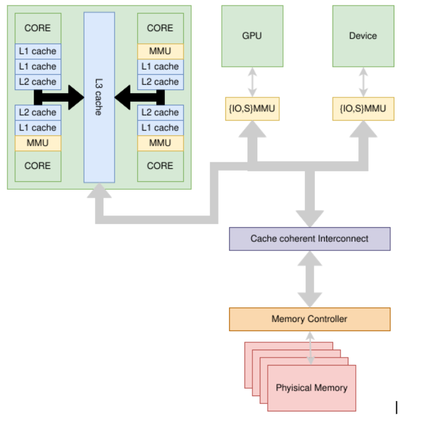
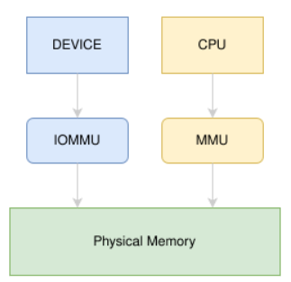
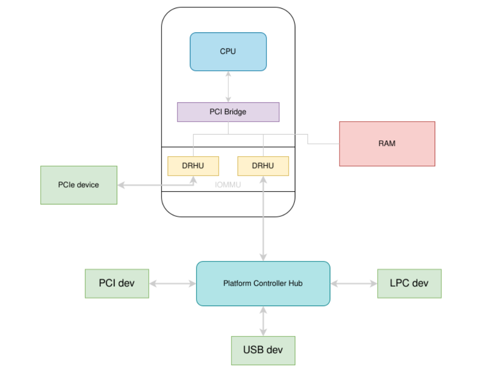
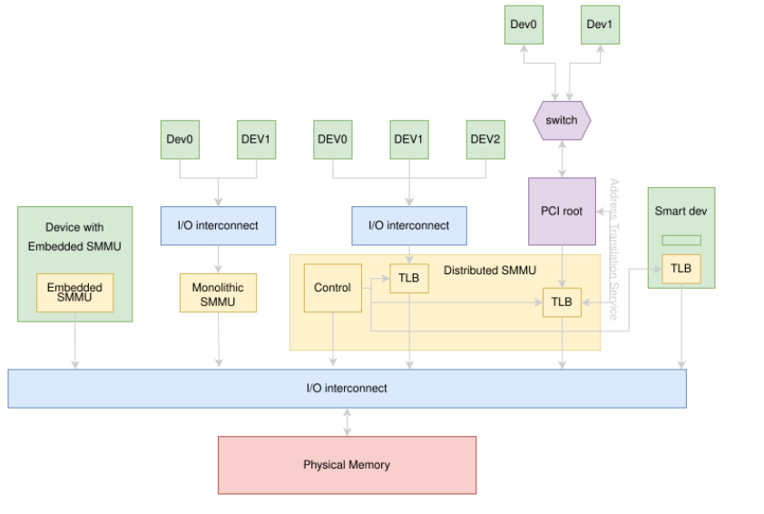

# Hardware access to physical memory

# Problem summary
Heterogeneous systems that integrate a multicore CPU, GPUs, DMAs and other 
IPs on the same die. All of these devices may access and share the same 
physical memory on these systems, allowing for unforeseen adverse 
interactions. 

Here is a non exhaustive list of devices that can access physical memory 
without any CPU assistance:

* System wide DMA channels (e.g., Intel 8237)
* Peripherals with integrated DMA controllers (e.g., PCI peripherals)
* GPUs with unified address space (e.g., Integrated graphics processing unit 
IGPU)
* Other non standard devices (e.g., Programmable Real-time microcontrollers)

# Device accessing memory
Having many heterogeneous devices interacting with the same physical memory 
leads to, at least, data synchronization issues. At the low level, cache 
coherence protocols[^1] are in place to guarantee data integrity, but still, 
having heterogeneous systems using the same physical memory, amplifies software
error consequences. 
A peripheral can access other peripherals' memory and the main RAM via DMA 
requests, even in kernel memory areas, without the main cpu's knowledge. 
GPUs running on a **unified address space** system can do the same. This is 
important in terms of security, but it may also have an impact on software 
safety. 
A poorly coded driver can instruct peripherals or GPUs to access buffer 
overwriting parts of the memory they are not supposed to, leading, as a 
consequence, to corruption of significant data structures.

## DMA
Direct Memory Access is the technique that allows CPUs to instruct the hardware 
to perform data transfers independently. By DMA, we can also refer to all 
devices able to become memory bus masters (able to access the physical memory). 
This kind of devices relieve the host processor from performing certain data 
copies and operations. DMA cycles have been added to these external buses, 
allowing peripherals to perform read/write accesses to other peripherals and 
RAM segments. Traditionally, systems had DMA controllers that allowed dumb 
peripherals to be managed by these. PCI peripherals dropped the need to use 
centralized DMA controllers since they own all the hardware needed to access 
the memory on their own.

## GPU
Traditional GPU architectures do not permit the CPU and GPU to access each 
other's memory. To enable data communication, data transfers between their 
distinct memories need to be explicitly programmed at the application level. 
Nvida introduced the Unified memory[^2] (not to be confused with Shared 
graphics memory[^3]) starting from its Kepler GK110 GPU[^4] 2012. ARM's 
first GPU adopting this technology is the Mali-G31 (2018 Q1). Shared memory 
between CPUs and GPUs is the foundation of what is known as **Heterogeneous 
System Architecture** (HSA)[^5]. By this technology, memory may be 
simultaneously accessed by the system's computational units (CPUs or GPUs) 
with the intent to provide communication or avoid redundant data structure 
copies. Despite the Heterogeneous System Architecture being beneficial for 
performance-related matters, it can raise questions on data integrity. 

## Programmable application specific coprocessors
Another category of devices that can share the memory with the Linux core 
CPUs is application-specific programmable coprocessors. Examples of this 
kind of device are **TI PRUs** and **STM32MP1 embedded STM32M4**, to name 
a few. If these examples look particularly exotic, we may consider something 
more familiar, such as the **Intel management engine**, a fully-featured 
processor running inside Intel's chipsets (northbridge or PCH). Programmable 
application-specific coprocessors are mainly unstandardized, which makes the 
task of investigating the topic reasonably tricky. The general message here is 
that these non-standardized features may or may not access the full memory or 
be brooked by an IOMMU; still, code running on these CAN corrupt the memory. 
To understand the complexity of this topic, you may refer a few emblematic 
scenarios:

* Intel Management Engine version 7 or newer: Feature the main processor 
**x86_64**, older ME, an **ARC core**. The ARC could access all the memory 
on such systems, and no IOMMU was out yet to control it. On recent systems, 
the ME, now ironically called "Converged Security Management Engine," 
controls the IOMMU memory directly[^6].
* A less common but emblematic example is Allwinner A64 SoC: It features a 
quad-core ARMv8.0 as the main processor, and as a power management unit, there 
is a programmable custom implementation of Open Risc 1k (OR1k) that shares 
its memory with the main core[^3].

In most cases, these programmable units are very constrained since they 
cannot address all the host RAM but only a small fixed area (tipically a few 
Kb); thus, making them unharmful is a trivial task. But due to the significant 
implementation difference these systems have, it is impossible to state 
any general direction on the topic. The suggestion is to start a targeted 
investigation as a system with such features is chosen as safe target.

# IOMMU/SMMU
All modern Operating Systems implement the concept of virtual memory, which is 
having each process running in a separate address space. This enables memory 
isolation, so that multiple processes running on the same machine can't see 
each other's address space. The Memory Management Unit (MMU) is a device 
responsible for making the address translation from virtual memory to physical 
memory.

Devices connected to the bus usually don't have memory virtualization. 
Instead, they all share the same address space and access physical memory using 
Direct Memory Access (DMA).  DMA enables I/O controllers to transfer data 
directly to or from the main memory.

In order to increase security and enable device address space isolation, a 
special MMU for devices was created, called I/O MMU, or system MMU depending
on dialects.

IOMMUs are relatively new hardware, and they are still far from being 
standardized. They not only have their name not fixed yet, but they are also 
not well determined when it comes to listing their features[^8] [^9] [^10]. 
The Linux kernel abstracts these differences pretty well, but as a matter of 
facts, they do not support the same features.
[^11] [^12] [^13] [^14] [^15] [^16] [^17] [^18] [^19] [^20] [^21] [^22] 
[^23] [^24] [^25]

## Architectural differences
The CPU uses MMU to translate a virtual address to a physical address. The 
IOMMU, in contrast, is used by devices to translate another virtual address 
called **IOVA**(IO virtual address) to a **PA**(physical address). 

Although IOMMUs are primarily used on virtual guests for device virtualization, 
they can also be used for system security and safety. The IOMMU's primary task 
is to translate IOVA on a **per device** basis. This means that similar to 
MMUs, that provide a VA to any process, IOMMUs provide an IOVA to any device 
served. One key aspect of the IOMMU behavior is identifying a device on the 
buses they serve. Typically, IOMMUs use the bus provided ids; for example, 
**BDFids** (Bus:Device:Function) are used for PCI devices. As a consequence, 
IOMMU must be specialized for the bus they serve. 

### Intel's IOMMUs
This section focuses on the mechanisms that enable a DMA remapping unit to 
translate a memory address and to decide either to reject or to forward the 
corresponding access request to the memory controller. When a DMA Remapping 
Hardware Unit(DRHU) intercepts a memory access, it needs to identify first 
the I/O controller that has requested the memory access and then determine the 
associated memory regions.

On current x86 architectures, all PCI and PCI Express controllers are 
identified by a unique triplet, referred to as its BDF-Id

* bus number: it corresponds to a number assigned by the BIOS to the bus 
which the I/O controller is physically connected to.
* device number: for a given bus number, it indicates the slot to which the 
I/O controller is connected to on that bus.
* function number: it identifies a subsystem in the I/O controller. For 
instance, on multiple ports USB cards, this number refers to the controller 
associated to a port.

All DMA requests arriving at a DRHU contain a BDF-Id reported in their 
requester-id field (or source-id, according to Intel VT-d terminology). 
A DRHU uses this meta-data to identify the I/O controller that requests the 
memory access and to determine the associated memory regions.

### ARM's SMMUs
A System Memory Management Unit (SMMU) performs a task that is analogous to 
that of an MMU in a CPU, translating addresses for DMA requests from system 
I/O devices before the requests are passed into the system interconnect.  In 
order to associate device traffic with translations and to differentiate 
devices behind an SMMU, requests have an extra property, alongside address, 
read/write, permissions, to identify a stream. 

A number of SMMUs might exist within a system. An SMMU might translate traffic 
from just one device or a set of devices.

## IOMMU initialization
The IOMMU initialization is another hot topic. The effectiveness of the IOMMU's 
service depends on how it gets configured. IOMMU assigns a particular IOVA to 
target devices, but the information is needed to make a working configuration. 
For a few devices, it can be trivial to get them; for other, general-purpose 
peripherals configuration can depend on a particular context where the 
peripheral is operating. Moreover, the OS expects the configuration to be 
firmware provided for many peripherals[^26] [^27] [^28]. (e.g., ACPI table or 
Device Tree blob). Another important aspect is what a couple of papers[^26] 
[^29] suggested about the default behavior for an IOMMU on receiving requests 
from an unknown device. They suggest the IOMMU default action for an unknown 
source DMA request is to **allow** the request. 

## Subpage items access
DMA makes the system vulnerable to DMA attacks and memory corruption in its 
basic form. These issues are supposed to be mitigated by the Input-Output 
Memory Management Unit (IOMMU), which adds a layer of virtual memory to 
devices. The IOMMU processes all I/O requests, translating their target I/O 
virtual addresses (IOVA) to physical addresses. In the process, the IOMMU 
provides address space isolation, allowing a device to access only permitted 
pages and preventing all other memory from being accessed. Unlike processes 
that operate at page granularity, I/O buffers can be significantly smaller 
than a page. I/O buffers and other kernel buffers can co-reside on the same 
physical pages, exposing these kernel structures to the device.

Due to historical reasons, having a DMA buffer near other kernel structures 
is not the first thing that comes to mind. The Intel 8237[^30], the DMA 
controller used in the old x86 machine, poses a lot of restrictions on how 
DMA could be used. It was bound to use lower memory, and so the Linux kernel 
used special pools of memory in the lower physical to satisfy these controller 
requirements. One consequence of this requirement was that it was unusual to 
have these lower physical memory pages used for kernel structures.

PCI DMA-capable devices do not have such requirements (although they have a 
very similar one concerning 64bit machine and 32bit PAE extension), but inside 
the 32bit world, their DMA buffer can be on any memory page. These devices' DMA 
buffers can be anywhere in the 32bit address space, so driver developers, to 
reduce the memory usage, can allocate them using the standard **kmalloc()**
and embed the buffer inside a data structure.

For making a DMA transfer in one shot, it is required that the hardware can 
access memory space, that it is not cached, and that it is physically 
contiguous. To allocate the memory for the buffer, you basically may follow 
a couple of strategies:

* Use specialized allocator: **dma_alloc_coherent()**[^31]. This allocator 
guarantees you you have your buffer in a hardware reachable address space and 
that it won't suffer from cache-related problems. The **dma_alloc_coherent()** 
allocates at least a full-page, so if you have many buffers to allocate, you 
may also use **dma_pool_create()**[^32] and **dma_pool_alloc()**[^33] to make 
smart use of it. But if you need just a single buffer smaller than the page 
size (typically 4k, but can be wider), you may consider another way.
* Go with one-direction streaming DMA mapping and use the standard 
**kmalloc()** and then **dma_map_single()**[^34] or **dma_map_sg()**[^35] 
depending if your buffer is physically fragmented or not.

In the latter case, unless bounce buffers are used by the DMA_api framework 
(there may be architectures that do this automatically, x86 does not), you 
may have the situation I pictured above. For this reason, known as the 
sub-page vulnerability, the IOMMU cannot fully protect the kernel from 
unprivileged access or the kernel's data structures to be overwritten.

To address this particular subpage issue, a couple of tools have been 
developed.

* Sub-Page Analysis for DMA Exposure (SPADE)[^36]: this tool is a source code 
static analyzer targeted to find data structures containing function pointers. 
It is primarily oriented to security and its objective is not to prevent 
casual corruption but corruption that may lead to control flow hijacking. 
Still, its reports are also points of casual data corruption.
* DMA-KASAN[^37]: dma-kasan patches the kernel by introducing the production 
of messages exposed by the kernel tracing framework (ftrace). It aims to 
report DMA violations.

# Unsafe DMA Access Failure Modes
1. A small ASILB DMA buffer is needed for a driver to perform its operations. 
The driver allocates its buffer using `devm_kalloc()` to make sure the buffer 
is automatically freed on driver unload. The resulting buffer results to be 
unaligned with caches lines whose size is defined by `ARCH_DMA_MINALIGN`. 
Because `devm_*` functions expect a descriptor on the top of the area, the 
`devm_kalloc()` is likely to be not aligned. The resulting dma transfer is 
likely to transfer corrupted data.

    **Mitigation:** for small buffers should avoid allocation using `devm_* `
functions at all, or at least, make sure the address is aligned with cache 
lines by allocating slightly more data and then adjust the start buffer 
address.

1. An ASILB DMA-able Kernel memory buffer is corrupted by another QM device 
with DMA capability. I.e.
    1. The ASILB Kernel Driver allocate the DMA buffer
    1. The QM device later on overwrite the content

    Assumption of use: there is an IOMMU capable device that is able to raise 
an error exception if the QM device access a page that do not belong to its 
IOVA space.

    **Mitigation:** the ASILB Kernel Driver shall allocate the DMA buffer by 
using `dma_alloc_coherent()` for large buffers or dma_pool_create() for buffer 
under a page size.

1. A QM Kernel Driver (maybe a legacy driver) first allocates a kernel virtual 
memory buffer using `kmalloc()`, then uses `dma_map_single()` to map the 
allocated Kernel virtual memory to the QM DMA device.
For some reason before or later an ASILB Kernel subsystem/driver allocates a 
kernel virtual memory buffer using `kmalloc()` and the buffer is returned from 
the same page where the DMA buffer above is allocated from.
Now due to a HW bug the QM DMA device accesses the memory buffer allocated by 
the ASILB subsystem/driver and corrupts it.

    Assumption of use: there is an IOMMU capable device that is able to raise 
an error exception if the QM device access a page that do not belong to its 
IOVA space, however the same IOMMU does not guarantee protection for a 
granularity smaller than a single page.

    **Mitigation:** the streaming DMA mappings shall not be used by any active 
QM DMA device driver (this must be guaranteed by the ASILB SoC Vendor).

# Conclusions
The document has listed and analyzed the entities accessing the system's 
physical memory. This work shows that independent entities can access system 
RAM and modify it. Fusa requires the address space integrity, but any of these 
subjects can potentially corrupt it. IOMMUs are designed to provide a virtual 
address space to devices that can access the host physical memory. Although 
this can prevent almost all DMA attacks, it can not guarantee protection 
against casual corruption. IOMMUs have memory page granularity when it comes 
to virtual address space definition, which means that, at best, they can not 
prevent devices from accessing any single byte within the allowed memory pages. 
Furthermore, IOMMUs as an actual device can not provide a dedicated Virtual 
address space for each device within the system. Concepts such as Domain and 
IOMMU groups are needed to associate a devices group to a particular DMA 
Remapping Hardware Unit. Because not all devices have the same needs in terms 
of accessing the host's physical memory, IOMMU must provide an IOVA, which is 
the union of all the addresses needed by every single device within the group, 
exposing more process data to the corruption of a malfunctioning 
peripheral/driver. In order to indicate which kind of device can be more 
dangerous: poorly programmed GPUs with a unified memory are more likely to 
cause problems. Unified memory for GPUs allows them to access data structures 
directly in place. Frameworks such as OpenMP use their own memory allocators, 
but in the end, these have no built-in memory corruption prevention mechanism, 
and structures are likely to be laid out one after another. DMA peripherals 
are the second most likely source of problems. Still, these are mitigated 
because the DMA buffer may be allocated in DMA reserved memory, and there, 
overflows might cause more minor issues. Evaluating the memory corruption 
risk for the microcontrollers embedded into the SoC is not a trivial task 
since they have not been standardized yet. Still, all implementations I've 
seen so far require this devices' operation memory to be well defined and 
mapped, which makes corruptions outside this memory range unlikely. 

# References
[^1]: [Cache coherence](https://en.wikipedia.org/wiki/Cache_coherence)
[^2]: [In-Depth Analyses of Unified Virtual Memory System for GPU Accelerated Computing](https://doi.org/10.1145/3458817.3480855)
[^3]: [Shared Graphic Memory](https://en.wikipedia.org/wiki/Shared_graphics_memory)
[^4]: [Nvidia KeplerTM GK110/210](https://www.nvidia.com/content/dam/en-zz/Solutions/Data-Center/tesla-product-literature/NVIDIA-Kepler-GK110-GK210-Architecture-Whitepaper.pdf)
[^5]: [Heterogeneous System Architecture](https://en.wikipedia.org/wiki/Heterogeneous_System_Architecture)
[^6]: [Intel's virtualization technology The Intel Converged Security and Management Engine IOMMU Hardware Issue - CVE-2019-0090](https://www.intel.com/content/dam/www/public/us/en/security-advisory/documents/cve-2019-0090-whitepaper.pdf)
[^7]: [Sunxi AR100](https://linux-sunxi.org/AR100)
[^8]: [Intel 64 and IA-32 Architectures Software Developer Manuals](https://www.intel.com/content/www/us/en/developer/articles/technical/intel-sdm.html)
[^9]: [Arm System Memory Management Unit Architecture Specification, SMMU architecture version 3](https://documentation-service.arm.com/static/60804fe25e70d934bc69f12d)
[^10]: [RISC-V I/O Management Unit (IOMMU) Rev 0.21](https://docs.google.com/document/d/1ytBZ6eDk1pAeBlZjDvm6_qqJbKQ0fMYKedyx0uoAGB0/edit#heading=h.aaaorcg4gat8)
[^11]: [Intel's VT-d iommu](https://elixir.bootlin.com/linux/v5.16/source/drivers/iommu/intel/iommu.c#L5561)
[^12]: [ARM smmuv1 struct definition](https://elixir.bootlin.com/linux/v5.16/source/drivers/iommu/arm/arm-smmu/arm-smmu.c#L1583)
[^13]: [arm smmuv3 struct definition](https://elixir.bootlin.com/linux/v5.16/source/drivers/iommu/arm/arm-smmu-v3/arm-smmu-v3.c#L2834)
[^14]: [AMD I/O Virtualization Technology](https://elixir.bootlin.com/linux/v5.16/source/drivers/iommu/amd/iommu.c#L2247)
[^15]: [Qualcomm iommu](https://elixir.bootlin.com/linux/v5.16/source/drivers/iommu/arm/arm-smmu/qcom_iommu.c#L590)
[^16]: [Qualcomm MSM iommu](https://elixir.bootlin.com/linux/v5.16/source/drivers/iommu/msm_iommu.c#L674)
[^17]: [Samsung exynos iommu](https://elixir.bootlin.com/linux/v5.16/source/drivers/iommu/exynos-iommu.c#L1310)
[^18]: [Mediatek's iommu ](https://elixir.bootlin.com/linux/v5.16/source/drivers/iommu/mtk_iommu.c#L659)
[^19]: [Texas Instruments' OMAP iommu ](https://elixir.bootlin.com/linux/v5.16/source/drivers/iommu/omap-iommu.c#L1735)
[^20]: [Rockchip's iommu](https://elixir.bootlin.com/linux/v5.16/source/drivers/iommu/rockchip-iommu.c#L1188)
[^21]: [Unisoc's iommu](https://elixir.bootlin.com/linux/v5.16/source/drivers/iommu/sprd-iommu.c#L417)
[^22]: [Allwinner's sun50i iommu](https://elixir.bootlin.com/linux/v5.16/source/drivers/iommu/sun50i-iommu.c#L761)
[^23]: [Nvidia's iommu](https://elixir.bootlin.com/linux/v5.16/source/drivers/iommu/tegra-gart.c#L278)
[^24]: [Nvidia's smmu](https://elixir.bootlin.com/linux/v5.16/source/drivers/iommu/tegra-smmu.c#L969)
[^25]: [IBM S390 iommu ](https://elixir.bootlin.com/linux/v5.16/source/drivers/iommu/s390-iommu.c#L363)
[^26]: [Exploiting an I/OMMU vulnerability](https://doi.org/10.1109/MALWARE.2010.5665798)
[^27]: [Hardware-based Cyber Threats](https://doi.org/10.5220/0006577202590266)
[^28]: [Characterizing, Exploiting, and Detecting DMA Code Injection Vulnerabilities in the Presence of an IOMMU](https://doi.org/10.1145/3447786.3456249)
[^29]: [Understanding DMA Malware](https://doi.org/10.1007/978-3-642-37300-8_2)
[^30]: [Intel 8237 DMA controller](https://en.wikipedia.org/wiki/Intel_8237)
[^31]: [dma_alloc_coherent()](https://elixir.bootlin.com/linux/v5.16/source/include/linux/dma-mapping.h#L415)
[^32]: [dma_pool_create()](https://elixir.bootlin.com/linux/v5.16/source/mm/dmapool.c#L130)
[^33]: [dma_pool_alloc()](https://elixir.bootlin.com/linux/v5.16/source/mm/dmapool.c#L314)
[^34]: [dma_map_single()](https://elixir.bootlin.com/linux/v5.16/source/include/linux/dma-mapping.h#L406)
[^35]: [dma_map_sg()](https://elixir.bootlin.com/linux/v5.16/source/include/linux/dma-mapping.h#L408)
[^36]: [Sub-Page Analysis for DMA Exposure (SPADE)](https://github.com/Markuze/mmo-static)
[^37]: [DMA Kernel Address SANitizer (DMA-KASAN)](https://github.com/Markuze/dma-kasan)
[^38]: [Coccinelle script for easing find dma buffers embedded into structures](https://gitlab.com/acarmina/dma-find/-/tree/master)
